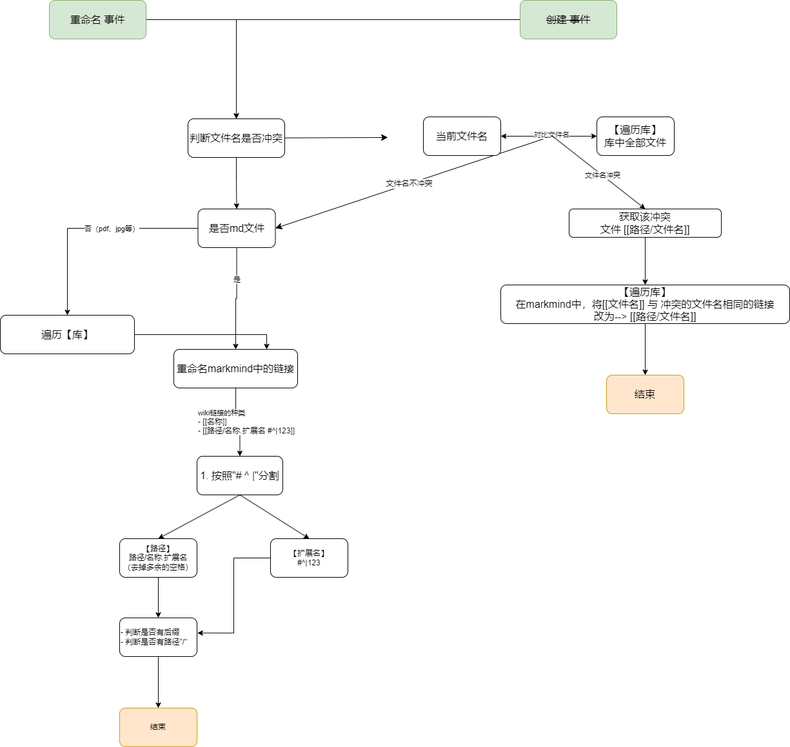

# obsidian-markmind-rich-rename

为[obsidian-markmind](https://github.com/MarkMindCkm/obsidian-markmind)的`rich模式`编写的插件，用于重命名文件时自动修改文件内的链接。
> 部分功能，抄[obsidian-attachment-management](https://github.com/trganda/obsidian-attachment-management)

**不是专业前端，不太会写js、ts，代码写的很烂，但是能用。**

支持：
- `[[文件名(扩展名)]]`、`![[文件名(扩展名)]]`、`[[文件夹/文件名(扩展名)]]`
- `[[文件名#123]]`、`[[文件名#^123]]`
- 标准markdown链接：`[名称](地址)`、``
- markmind中的节点链接

<b style="color: red"> 还未充分大规模验证，会有bug，且更新链接会直接修改笔记，❗❗❗请创建新库进行测试❗❗❗ </b>

原理如下：

